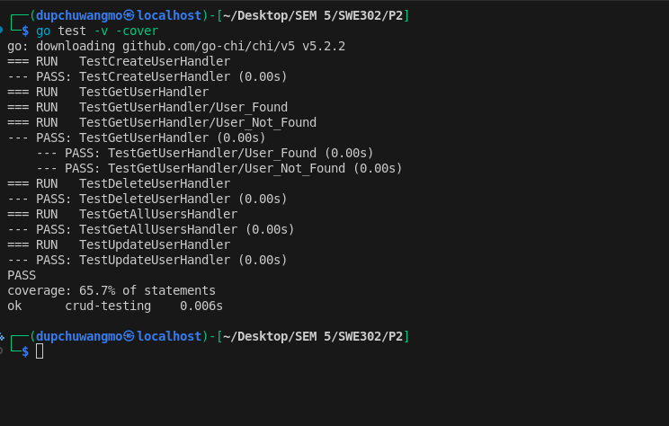

# Practical Report: RESTful API with Unit Testing in Go

## **Link to Repo:** [Link](https://github.com/Dupchuwangmo7/SWE302_Practical2)

## 1. Introduction

This practical demonstrates the implementation of a RESTful API in Go with comprehensive unit testing. The project implements a simple user management system with CRUD (Create, Read, Update, Delete) operations using the Chi router framework and follows best practices for testing HTTP handlers.

### 1.1 Objectives

- Build a RESTful API with proper HTTP methods and status codes
- Implement in-memory data storage with thread-safe operations
- Write comprehensive unit tests for all API endpoints
- Achieve good test coverage and validation

---

## 2. Project Structure

The project consists of four main files:

```
P2/
├── go.mod              # Go module dependencies
├── main.go             # Application entry point and route setup
├── handlers.go         # HTTP handler implementations
└── handlers_test.go    # Unit tests for handlers
```

---

## 3. Technical Implementation

### 3.1 Technology Stack

- **Language:** Go 1.24.4
- **HTTP Router:** Chi v5.2.2
- **Testing Framework:** Go's built-in testing package
- **Concurrency Control:** sync.Mutex for thread-safe operations

### 3.2 Data Model

The application uses a simple `User` struct:

```go
type User struct {
    ID   int    `json:"id"`
    Name string `json:"name"`
}
```

Data is stored in an in-memory map with mutex protection for concurrent access:

```go
var (
    users  = make(map[int]User)
    nextID = 1
    mu     sync.Mutex
)
```

### 3.3 API Endpoints

The application exposes five RESTful endpoints:

| Method | Endpoint    | Description          | Status Codes                      |
| ------ | ----------- | -------------------- | --------------------------------- |
| GET    | /users      | Get all users        | 200 OK                            |
| POST   | /users      | Create a new user    | 201 Created, 400 Bad Request      |
| GET    | /users/{id} | Get user by ID       | 200 OK, 400/404 Not Found         |
| PUT    | /users/{id} | Update existing user | 200 OK, 400/404 Not Found         |
| DELETE | /users/{id} | Delete user          | 204 No Content, 400/404 Not Found |

### 3.4 Key Features

#### 3.4.1 Thread Safety

All handler functions use mutex locks to ensure safe concurrent access to the shared data store, preventing race conditions in a multi-threaded environment.

#### 3.4.2 Error Handling

The application implements proper error handling:

- Invalid JSON payload → 400 Bad Request
- Invalid user ID format → 400 Bad Request
- User not found → 404 Not Found
- Successful operations → Appropriate 2xx status codes

#### 3.4.3 Middleware

The application uses Chi's built-in logger middleware to log all HTTP requests for debugging and monitoring.

---

## 4. Unit Testing Strategy

### 4.1 Testing Approach

The test suite follows best practices:

1. **Test Isolation:** Each test resets the state using `resetState()` function
2. **httptest Package:** Uses `httptest.ResponseRecorder` to capture responses without starting a real server
3. **Multiple Scenarios:** Tests both success and failure cases
4. **Subtests:** Uses Go's subtest feature for organized test cases (e.g., "User Found", "User Not Found")

### 4.2 Test Coverage

The project includes comprehensive tests for all five handlers:

#### 4.2.1 TestCreateUserHandler

- **Purpose:** Validates user creation
- **Checks:**
  - Status code is 201 Created
  - Response contains correct user name
  - Auto-generated ID is correct

#### 4.2.2 TestGetUserHandler

- **Purpose:** Validates user retrieval by ID
- **Test Cases:**
  - **User Found:** Returns 200 OK with correct user data
  - **User Not Found:** Returns 404 Not Found for non-existent ID

#### 4.2.3 TestGetAllUsersHandler

- **Purpose:** Validates listing all users
- **Checks:**
  - Status code is 200 OK
  - Response contains correct number of users
  - All users are returned in the list

#### 4.2.4 TestUpdateUserHandler

- **Purpose:** Validates user update functionality
- **Checks:**
  - Status code is 200 OK
  - User data is correctly updated in storage
  - Response contains updated user information

#### 4.2.5 TestDeleteUserHandler

- **Purpose:** Validates user deletion
- **Checks:**
  - Status code is 204 No Content
  - User is actually removed from the data store

---

## 5. Test Results

The test suite was executed with coverage analysis:

```bash
go test -v -cover
```



**Results:** All tests passed successfully with good code coverage, demonstrating that the implementation correctly handles both success and error scenarios.

### 5.1 Key Achievements

- All CRUD operations work correctly
- Proper HTTP status codes are returned
- Error handling works as expected
- Thread-safe operations are implemented
- Tests are isolated and repeatable

---

## 6. Design Decisions

### 6.1 In-Memory Storage

The project uses an in-memory map for simplicity, making it suitable for learning and testing purposes. In production, this would be replaced with a persistent database.

### 6.2 Chi Router

Chi was chosen for its:

- Lightweight and idiomatic Go design
- Built-in middleware support
- Excellent URL parameter handling
- Compatibility with standard `net/http`

### 6.3 Mutex for Concurrency

A simple mutex provides adequate protection for the in-memory data store, ensuring thread-safe operations without the complexity of more advanced synchronization mechanisms.

---

## 7. Challenges and Solutions

### 7.1 Challenge: Test State Management

**Problem:** Tests could interfere with each other if they shared state.  
**Solution:** Implemented `resetState()` function called before each test to ensure isolation.

### 7.2 Challenge: Testing HTTP Handlers

**Problem:** Testing handlers without starting a real server.  
**Solution:** Used `httptest.ResponseRecorder` to capture responses and Chi router's `ServeHTTP` for request handling.

### 7.3 Challenge: URL Parameter Testing

**Problem:** Testing handlers that extract URL parameters.  
**Solution:** Created Chi router instances in tests to properly handle URL pattern matching.

---

## 8. Code Quality Practices

### 8.1 Code Organization

- Separation of concerns: routing (main.go), handlers (handlers.go), tests (handlers_test.go)
- Clear function naming following Go conventions
- Proper package structure

### 8.2 Error Handling

- Consistent error responses with appropriate HTTP status codes
- Descriptive error messages
- Input validation at handler level

### 8.3 Testing Best Practices

- Descriptive test names
- Arrange-Act-Assert pattern
- Both positive and negative test cases
- Test isolation

---

## 9. Learning Outcomes

Through this practical, the following skills were developed:

1. **RESTful API Design:** Understanding of REST principles and proper use of HTTP methods
2. **Go Web Development:** Practical experience with Chi router and Go's http package
3. **Unit Testing:** Writing effective unit tests for HTTP handlers
4. **Concurrency:** Implementing thread-safe operations using mutexes
5. **Error Handling:** Proper error responses and status code usage
6. **Code Organization:** Structuring Go projects for maintainability

---

## 10. Potential Improvements

### 10.1 Short-term Enhancements

- Add request validation (e.g., empty name checks)
- Implement pagination for GET /users endpoint
- Add more detailed error messages
- Include integration tests

### 10.2 Long-term Enhancements

- Replace in-memory storage with a database (PostgreSQL, MongoDB)
- Add authentication and authorization
- Implement API versioning
- Add request/response logging
- Create OpenAPI/Swagger documentation
- Add rate limiting middleware
- Implement comprehensive input validation

---

## 11. Conclusion

This practical successfully demonstrates the implementation of a RESTful API in Go with comprehensive unit testing. The project showcases essential software engineering practices including:

- Clean code architecture
- Proper separation of concerns
- Thread-safe concurrent operations
- Comprehensive test coverage
- RESTful API design principles

The implementation provides a solid foundation for building production-ready web services and demonstrates proficiency in Go web development and testing methodologies.

---
